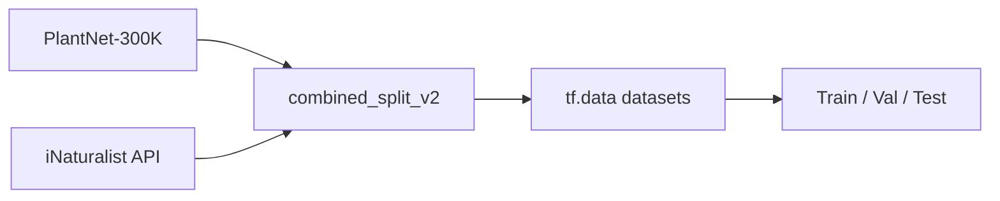

# Plant Species Recognition

A deep learning project that trains a **93-class plant species classifier** by combining curated images from **PlantNet-300K** with user-contributed photos from **iNaturalist**. The main workflow lives in a Jupyter notebook; reusable utilities live under `src/`.

The model targets **real-world plant photos** (varied lighting, angles, and backgrounds) rather than studio-only imagery, using transfer learning on **EfficientNetB3** with a two-stage training schedule and strong data augmentation.

---

## Table of contents

- [Overview](#overview)
- [Features](#features)
- [Project structure](#project-structure)
- [Requirements](#requirements)
- [Setup](#setup)
- [Data pipeline](#data-pipeline)
- [Model & training](#model--training)
- [Running the pipeline](#running-the-pipeline)
- [Inference](#inference)
- [Outputs & artifacts](#outputs--artifacts)
- [Hardware notes](#hardware-notes)
- [Troubleshooting](#troubleshooting)
- [License & datasets](#license--datasets)

---

## Overview

| Item | Detail |
|------|--------|
| **Task** | Multi-class image classification (plant species) |
| **Classes** | 93 species (trees, shrubs, ornamentals, etc.) |
| **Backbone** | EfficientNetB3 (ImageNet weights) |
| **Input size** | 300×300×3 RGB |
| **Data sources** | PlantNet-300K (Kaggle) + iNaturalist API |
| **Primary entry point** | `notebooks/egitilmis_model.ipynb` |

Class labels follow the pattern `plantnet__<species_id>` (e.g. `plantnet__1355868` for *Rosa canina*). A JSON map links IDs to scientific names for display and evaluation.

**Reported metrics** (from a full notebook run on the held-out test set):

- **Test accuracy:** ~81.8%
- **Validation accuracy (best fine-tune):** ~81.3%
- **Stage 1 validation accuracy (frozen backbone):** ~64.4%

Per-class accuracy varies; the notebook prints the weakest and strongest species after evaluation.

---

## Features

- **Multi-source dataset:** PlantNet provides structured train/val/test splits; iNaturalist adds diverse field photos (~300 images per species target).
- **Unified folder layout:** Merged data under `data/combined_split_v2/{train,val,test}/plantnet__<id>/`.
- **Class-weighted loss:** Handles imbalance when some species have fewer images.
- **Two-stage transfer learning:** Frozen backbone, then partial unfreezing of the last 40 EfficientNet layers.
- **Aggressive augmentation:** Flips, rotation, zoom, and contrast jitter during training only.
- **Export for deployment:** Saves Keras `.keras`, training history JSON, and optional **TFLite** for mobile/edge.
- **Test-time augmentation (TTA):** Optional 8-view averaging for single-image prediction (`src/predict_tta.py` — see [Inference](#inference)).

---

## Project structure

```
plant_project/
├── notebooks/
│   └── egitilmis_model.ipynb    # End-to-end training & evaluation pipeline
├── src/
│   ├── paths.py                 # Central pathlib paths (project root, data, models, …)
│   ├── predict_tta.py           # CLI: single-image prediction with optional TTA
│   └── build_notebook.py        # Regenerates the training notebook from a template
├── data/                        # Datasets & splits (gitignored)
├── models/                      # Saved checkpoints & TFLite (gitignored)
├── class_names/                 # class_names.json, species ID map (gitignored)
├── outputs/                     # Metrics, plots, training history (gitignored)
├── logs/                        # Training logs (gitignored)
├── requirements.txt
├── CLAUDE.md                    # Short contributor guide for AI assistants
└── README.md
```

Large binaries and generated data are listed in `.gitignore` so clones stay lightweight; you reproduce artifacts locally by running the notebook.

---

## Requirements

- **Python 3.10+** recommended
- **TensorFlow 2.x** (notebook tested with 2.21)
- **Kaggle CLI** (for PlantNet download)
- **Internet access** (iNaturalist image download via public API)
- **Disk space:** PlantNet-300K is large; merged splits plus iNaturalist images need tens of GB depending on how much you download

Install Python dependencies:

```bash
python -m venv .venv
# Windows
.venv\Scripts\activate
# macOS / Linux
source .venv/bin/activate

pip install -r requirements.txt
pip install pillow   # required for src/predict_tta.py (image loading)
```

Register the project as a Jupyter kernel (optional):

```bash
python -m ipykernel install --user --name plant_project
```

---

## Setup

### 1. Clone the repository

```bash
git clone <your-repo-url>
cd plant_project
```

### 2. Kaggle API (PlantNet-300K)

1. Create a [Kaggle](https://www.kaggle.com/) account and API token (`kaggle.json`).
2. Place it at:
   - **Windows:** `%USERPROFILE%\.kaggle\kaggle.json`
   - **macOS / Linux:** `~/.kaggle/kaggle.json`

### 3. Download PlantNet-300K

```bash
kaggle datasets download -d noahbadoa/plantnet-300k-images -p data --unzip
```

After extraction you should have a layout similar to:

```
data/plantnet_300K/
├── images_train/<species_id>/*.jpg
├── images_val/<species_id>/*.jpg
└── images_test/<species_id>/*.jpg
```

The notebook also accepts `data/plantnet_300k/` (lowercase). If you previously built `data/combined_split/`, that legacy layout is still supported as a fallback.

### 4. iNaturalist images

The notebook **downloads images automatically** from the [iNaturalist API](https://api.inaturalist.org/v1/) into:

```
data/inat_images/<Scientific_name_with_underscores>/
```

This step can take a long time (93 species × up to 300 images). You can re-run only the download cell if interrupted; existing files are skipped when possible.

---

## Data pipeline

The notebook runs these stages in order:



### Species list

93 species are defined in the notebook as a **PlantNet species ID → scientific name** map (`SPECIES`). Folder names use `plantnet__<id>`.

### Merging PlantNet + iNaturalist

| Source | Role | Split behavior |
|--------|------|----------------|
| **PlantNet** | Curated botanical images | Uses Kaggle `images_train` / `images_val` / `images_test` per species ID |
| **iNaturalist** | In-the-wild diversity | 240 train / 30 val / 30 test per species (from up to 300 downloaded images) |

Output directory:

```
data/combined_split_v2/
├── train/plantnet__<id>/*.jpg
├── val/plantnet__<id>/*.jpg
└── test/plantnet__<id>/*.jpg
```

### Training-time augmentation

Applied only on the training set (in `[0, 255]` float space, then `efficientnet.preprocess_input`):

| Transform | Setting |
|-----------|---------|
| Random flip | Horizontal and vertical |
| Random rotation | ±30% (≈ ±108°) |
| Random zoom | ±25% |
| Random contrast | ±30% |

Validation and test pipelines use no augmentation.

### Class weights

Computed from the training set to down-weight over-represented classes and up-weight rare ones (`class_weight` in `model.fit`).

---

## Model & training

### Architecture

```
Input (300×300×3)
  → EfficientNetB3 (ImageNet, include_top=False)
  → GlobalAveragePooling2D
  → Dropout(0.4)
  → Dense(93, softmax, L2 λ=1e-4)
```

### Two-stage schedule

| Stage | Backbone | Optimizer | Max epochs | Callbacks |
|-------|----------|-----------|------------|-----------|
| **1 — Head training** | Frozen | Adam `lr=1e-3` | 10 | `ModelCheckpoint`, `EarlyStopping` (patience 4, monitor `val_accuracy`) |
| **2 — Fine-tuning** | Last **40** layers trainable | Adam `lr=1e-5` | 25 | Checkpoint, early stop (patience 6), `ReduceLROnPlateau` |

Both stages use `sparse_categorical_crossentropy` and **class-weighted** fitting. Batch size defaults to **32**; random seed **42** for reproducibility.

---

## Running the pipeline

### Interactive (recommended)

From the project root:

```bash
jupyter notebook notebooks/egitilmis_model.ipynb
```

Run cells **top to bottom**. The notebook auto-detects `PROJECT_ROOT` whether you start Jupyter from the repo root or from `notebooks/`.

**Suggested cell order:**

1. Imports & constants  
2. Species list (93 classes)  
3. iNaturalist download *(may take hours)*  
4. Merge → `combined_split_v2`  
5. `tf.data` pipeline + augmentation  
6. Class weights  
7. Model definition  
8. Stage 1 training  
9. Stage 2 fine-tuning  
10. Evaluation (test accuracy, per-class table)  
11. Save model, `class_names.json`, ID map, history  
12. TFLite conversion  
13. TTA smoke test  

### Regenerate the notebook from code

If you edit the pipeline template:

```bash
python src/build_notebook.py
```

This overwrites `notebooks/egitilmis_model.ipynb` with the version defined in `build_notebook.py`.

---

## Inference

### From the notebook

The last cells load `models/efficientnetb3_93classes.keras` and run predictions with optional TTA on sample images.

### Command line (`predict_tta.py`)

```bash
python src/predict_tta.py path/to/leaf.jpg
python src/predict_tta.py path/to/leaf.jpg --top 5
python src/predict_tta.py path/to/leaf.jpg --no-tta
```

**Important:** `predict_tta.py` was written for an older **MobileNetV2 / 224×224** checkpoint (`best_finetuned_model_v2.keras`). The current notebook produces **`efficientnetb3_93classes.keras` at 300×300**. For CLI inference with the new model, either:

- Use the notebook’s prediction cells, or  
- Update `predict_tta.py` to load `efficientnetb3_93classes.keras`, resize to **300×300**, and apply `preprocess_input` from `tensorflow.keras.applications.efficientnet`.

When aligned, TTA averages **8 variants**: original, horizontal flip, vertical flip, and 90°/180°/270° rotations on the flipped variants.

Display names resolve via `class_names/plantnet_species_id_map.json` when present.

---

## Outputs & artifacts

After a successful run (paths are gitignored locally):

| Path | Description |
|------|-------------|
| `models/efficientnetb3_stage1.keras` | Best weights after stage 1 |
| `models/efficientnetb3_93classes.keras` | Best / final fine-tuned model |
| `models/plant_model_93classes.tflite` | Mobile-friendly export |
| `models/class_names.json` | Copy of labels for bundling with TFLite |
| `class_names/class_names.json` | Ordered list of 93 `plantnet__<id>` strings |
| `class_names/plantnet_species_id_map.json` | ID → scientific name |
| `outputs/training_history_93classes.json` | Loss & accuracy per epoch |

Share models via release assets or cloud storage; do not commit multi-hundred-MB files to Git.

---

## Hardware notes

- **GPU:** Training is much faster on GPU. On **native Windows**, TensorFlow 2.11+ often runs **CPU-only**; use **WSL2**, Linux, macOS, or the TensorFlow-DirectML plugin if you need GPU on Windows.
- **RAM:** EfficientNetB3 with batch size 32 needs sufficient system memory; reduce `BATCH_SIZE` in the notebook if you hit OOM errors.
- **Time:** A full two-stage run on CPU can take many hours per epoch (thousands of steps). Plan accordingly or use cloud GPU (Colab, Kaggle Notebooks, etc.).

---

## Troubleshooting

| Issue | What to try |
|-------|-------------|
| `PROJECT_ROOT` wrong | Start Jupyter from repo root, or ensure `requirements.txt` is visible one level up from `notebooks/` |
| PlantNet not found | Confirm `data/plantnet_300K/images_train` exists after Kaggle unzip |
| iNaturalist download slow / fails | Re-run cell 3; check network; some species may return fewer than 300 images |
| Out of memory | Lower `BATCH_SIZE` (e.g. 16 or 8) |
| `predict_tta.py` wrong results | Model/input size mismatch — use EfficientNet 300×300 checkpoint (see [Inference](#inference)) |
| Missing `class_names` at inference | Run notebook cell 11 or copy JSON from a trained environment |

---

## License & datasets

- **Code in this repo:** follow your repository license (add a `LICENSE` file if not present).
- **PlantNet-300K:** subject to [Kaggle dataset terms](https://www.kaggle.com/datasets/noahbadoa/plantnet-300k-images).
- **iNaturalist:** images and metadata are subject to [iNaturalist terms](https://www.inaturalist.org/pages/terms) and individual observer licenses; use responsibly in research and apps.

When publishing or deploying a model trained on these sources, cite the datasets and respect any non-commercial or attribution requirements that apply to your use case.

---

## Quick reference

```bash
# Install
pip install -r requirements.txt

# Data (PlantNet)
kaggle datasets download -d noahbadoa/plantnet-300k-images -p data --unzip

# Train (interactive)
jupyter notebook notebooks/egitilmis_model.ipynb

# Predict (after aligning predict_tta.py with your checkpoint)
python src/predict_tta.py sample.jpg --top 3
```

For a concise machine-oriented summary of commands and layout, see [`CLAUDE.md`](CLAUDE.md).
